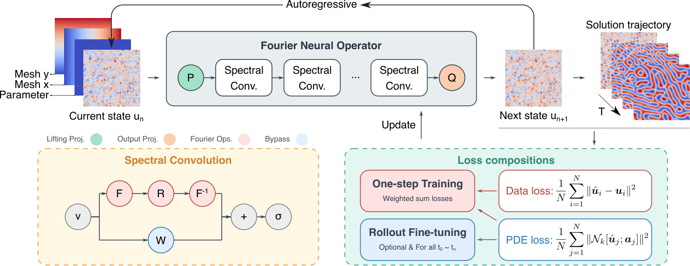
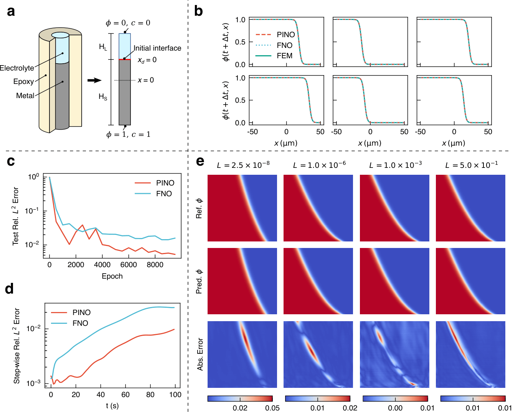
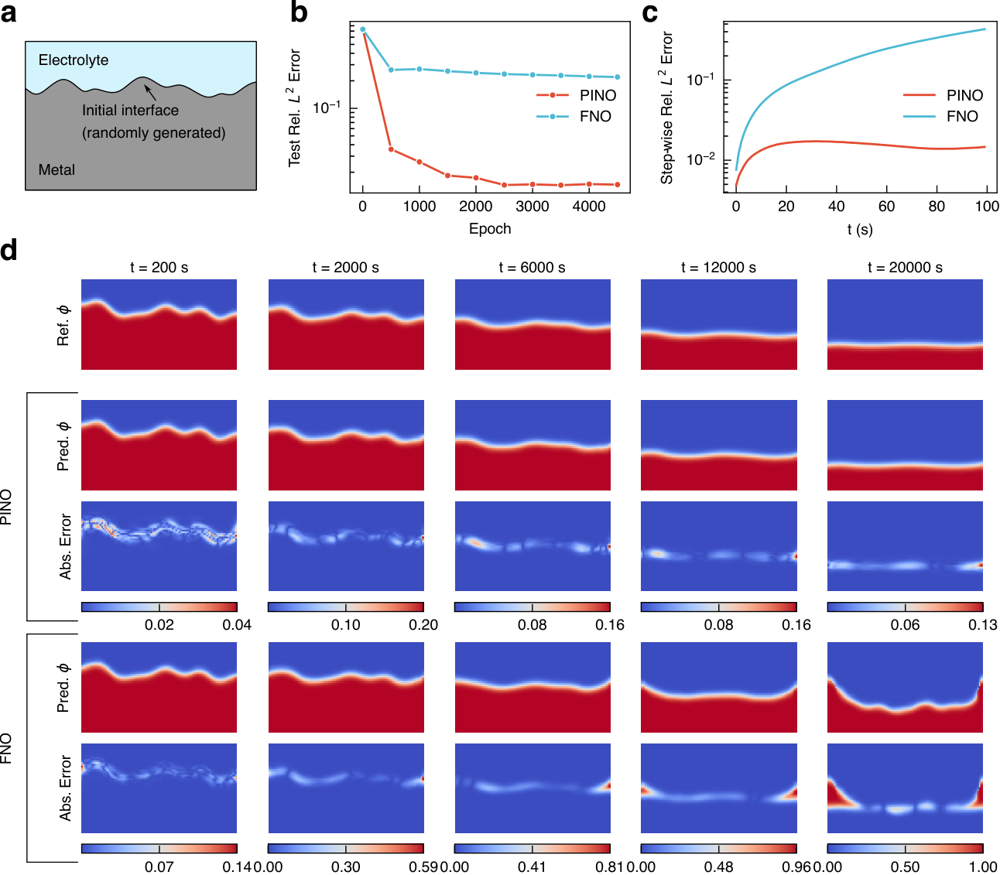
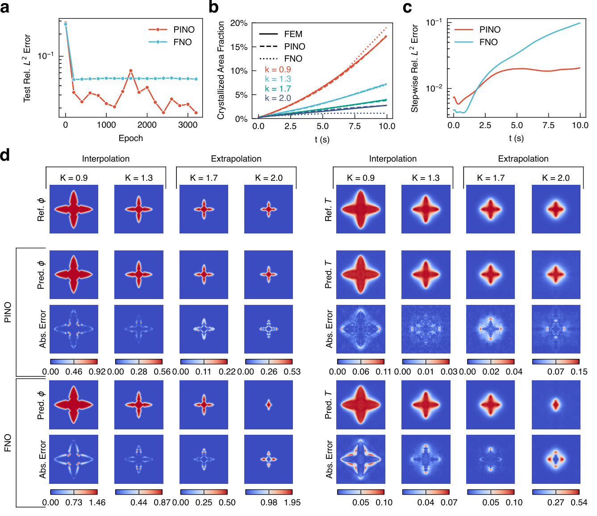
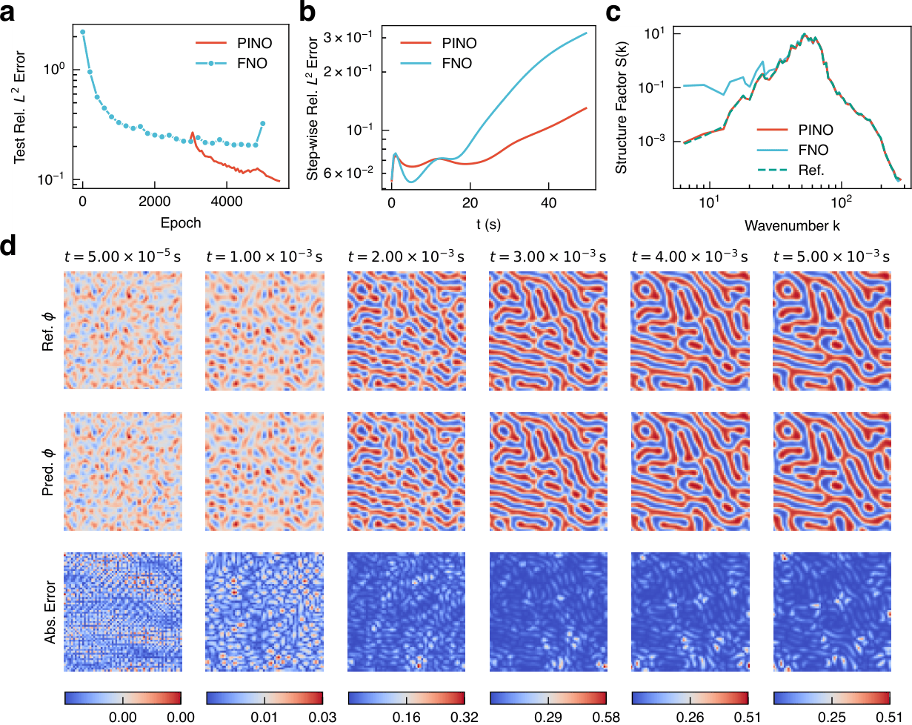

# Physics-informed neural operator for predictive parametric phase-field modelling

This repository implements a physics-informed neural operator (PINO) for predictive parametric phase-field modelling. The residuals of phase-field equations are enforced in the loss function. Our results demonstrate that PF-PINO significantly outperforms conventional FNO in accuracy, generalisation capability, and long-term stability.



## Applications

### Pencil-electrode corrosion



### Electro-polishing corrosion




### Dendritic growth



### Spinodal decomposition




## Citations

```bibtex
@misc{chen2026physicsinformedneuraloperatorpredictive,
      title={Physics-informed neural operator for predictive parametric phase-field modelling}, 
      author={Nanxi Chen and Airong Chen and Rujin Ma},
      year={2026},
      eprint={2603.09693},
      archivePrefix={arXiv},
      primaryClass={cs.LG},
      url={https://arxiv.org/abs/2603.09693}, 
}
```
